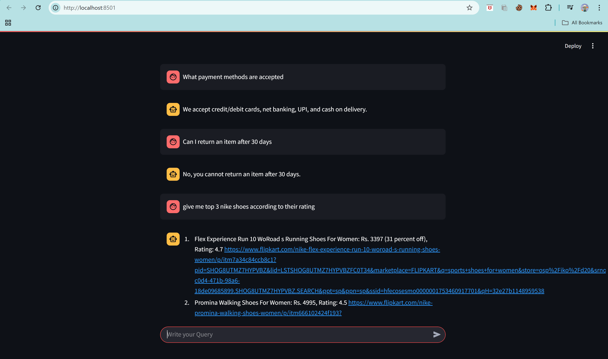
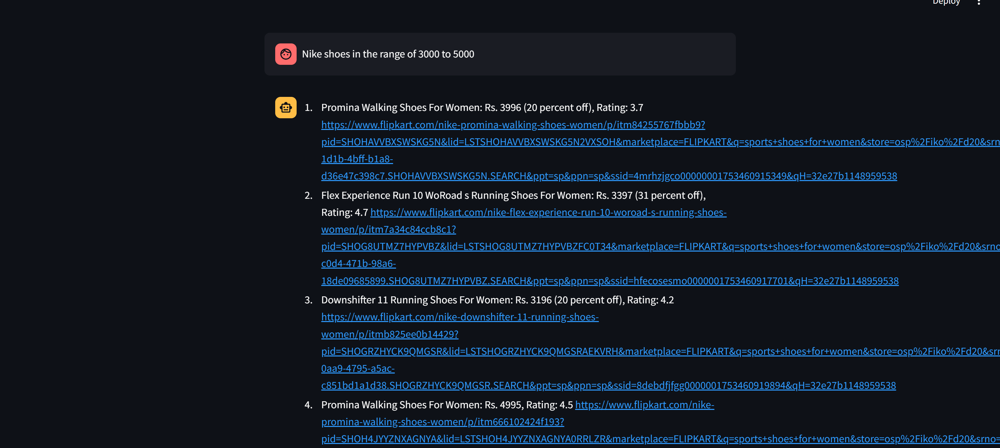

# Flipkart E-commerce AI Chatbot (Hybrid Conversational Assistant)

## Project Overview

This project develops a sophisticated AI-powered chatbot designed to enhance the customer experience on the Flipkart e-commerce platform. It leverages a hybrid architecture, intelligent routing, and various AI/ML and data management technologies to provide comprehensive answers to user queries, ranging from general FAQs to specific product details. The project aims to evolve into a full-fledged conversational commerce solution.

## Features

- **Intelligent Query Routing:** Utilizes a **Semantic Router** to semantically understand user intent and direct queries to the most appropriate backend logic (FAQ or SQL database).
- **FAQ (Knowledge Base) Route:**
  - Answers general questions about Flipkart, policies, or common inquiries.
  - Leverages **ChromaDB** as a vector store for efficient semantic search of pre-defined FAQs.
  - Employs an **LLM** (via GroqCloud) to generate natural and helpful responses based on retrieved information.
- **Product Information (SQL) Route:**
  - Answers specific questions related to product details (e.g., price, brand, ratings, discounts).
  - Dynamically generates **SQL queries** using an **LLM** (GroqCloud) from natural language prompts.
  - Retrieves product data from a local **SQLite3** database populated via web scraping.
  - Uses an **LLM** to synthesize human-like answers from the fetched database records.
- **Automated Data Acquisition:**
  - Includes a robust **Selenium** web scraping pipeline to collect up-to-date product details (e.g., ~1000 women's sports shoes) from Flipkart.
  - Automates data loading into the SQLite database.

## Technologies Used

- **Python:** Primary programming language.
- **Large Language Models (LLM):** GroqCloud (for rapid inference).
- **Orchestration Framework:** LangChain.
- **Intelligent Routing:** Semantic Router.
- **Vector Database:** ChromaDB (for FAQ embeddings).
- **Web Scraping:** Selenium.
- **Database:** SQLite3.
- **Data Manipulation:** Pandas.
- **Operating System Utilities:** `os` module (for path handling).

## Project Structure

My apologies if the formatting made it seem like multiple files. The entire README.md content was provided as a single text block.

Here is the complete README.md file again, presented as a single, copyable block of text. You should be able to click a "copy code" or similar button often provided by the chat interface itself when hovering over such a block.

Markdown

# Flipkart E-commerce AI Chatbot (Hybrid Conversational Assistant)

## Project Overview

This project develops a sophisticated AI-powered chatbot designed to enhance the customer experience on the Flipkart e-commerce platform. It leverages a hybrid architecture, intelligent routing, and various AI/ML and data management technologies to provide comprehensive answers to user queries, ranging from general FAQs to specific product details. The project aims to evolve into a full-fledged conversational commerce solution.

## Features

- **Intelligent Query Routing:** Utilizes a **Semantic Router** to semantically understand user intent and direct queries to the most appropriate backend logic (FAQ or SQL database).
- **FAQ (Knowledge Base) Route:**
  - Answers general questions about Flipkart, policies, or common inquiries.
  - Leverages **ChromaDB** as a vector store for efficient semantic search of pre-defined FAQs.
  - Employs an **LLM** (via GroqCloud) to generate natural and helpful responses based on retrieved information.
- **Product Information (SQL) Route:**
  - Answers specific questions related to product details (e.g., price, brand, ratings, discounts).
  - Dynamically generates **SQL queries** using an **LLM** (GroqCloud) from natural language prompts.
  - Retrieves product data from a local **SQLite3** database populated via web scraping.
  - Uses an **LLM** to synthesize human-like answers from the fetched database records.
- **Automated Data Acquisition:**
  - Includes a robust **Selenium** web scraping pipeline to collect up-to-date product details (e.g., ~1000 women's sports shoes) from Flipkart.
  - Automates data loading into the SQLite database.

## Technologies Used

- **Python:** Primary programming language.
- **Large Language Models (LLM):** GroqCloud (for rapid inference).
- **Orchestration Framework:** LangChain.
- **Intelligent Routing:** Semantic Router.
- **Vector Database:** ChromaDB (for FAQ embeddings).
- **Web Scraping:** Selenium.
- **Database:** SQLite3.
- **Data Manipulation:** Pandas.
- **Operating System Utilities:** `os` module (for path handling).

## Project Structure

├── app/
│ ├── sql.py # Handles SQL query generation and database interaction
│ ├── faq.py # Handles FAQ semantic search and response generation
│ ├── main_chatbot.py # Main entry point for the chatbot logic (hypothetical)
│ ├── db.sqlite # SQLite database file (generated/populated)
│ └── resources/ # Directory for FAQ data, etc.
│ └── faq_data.csv
├── webscraping/
│ ├── web_scraper.py # Selenium-based web scraping script
│ ├── csv_to_sqlite.py # Script to load scraped CSV data into SQLite
│ ├── flipkart_product_data.csv # Output of web scraping
│ └── flipkart_product_links.csv # Intermediate output of web scraping
├── .gitignore # Ensures db.sqlite is not committed
├── requirements.txt # Python dependencies
└── README.md # This file

## Usage

1.  **Scrape Data and Populate Database:**
    Navigate to the `webscraping` directory and run the script to populate your SQLite database. This will create `db.sqlite` in the `app` folder and load product data.

    ```bash
    cd webscraping
    python web_scraper.py          # (If your web_scraper.py directly outputs CSV)
    python csv_to_sqlite.py
    cd .. # Go back to root directory
    ```

    _(Ensure `flipkart_product_data.csv` is generated by `web_scraper.py` in the same directory as `csv_to_sqlite.py` for this step to work.)_

2.  **Initialize FAQ Database:**
    Navigate to the `app` directory and run your FAQ setup script (e.g., `faq.py` if it contains the ChromaDB population logic).

    ```bash
    cd app
    python faq.py                  # (If faq.py handles ChromaDB initialization)
    cd ..
    ```

3.  **Run the Chatbot:**
    Execute your main chatbot application script from the project root.
    `bash
    python app/main_chatbot.py     # (Assuming main_chatbot.py is your entry point)
    `
    
    

## Future Enhancements (Roadmap)

- **Automated Data Refresh:** Implement **cron jobs** (or cloud schedulers) to automatically run the web scraping and database population script daily, ensuring product information is always up-to-date.
- **"Add to Cart" Functionality:** Integrate directly with Flipkart's API to enable users to add products to their shopping cart directly through conversational commands, enhancing the conversational commerce experience.
- **User Session Management:** Implement robust session management for personalized interactions and persistent cart/conversation history.
- **Deployment:** Deploy the entire application to a cloud platform (e.g., AWS, GCP, Azure, Render) ensuring database persistence and secure API key management.
- **Advanced Error Handling & Logging:** Implement comprehensive error handling and detailed logging for production readiness.
- **Scalability:** Optimize for handling a higher volume of user queries and larger datasets.
